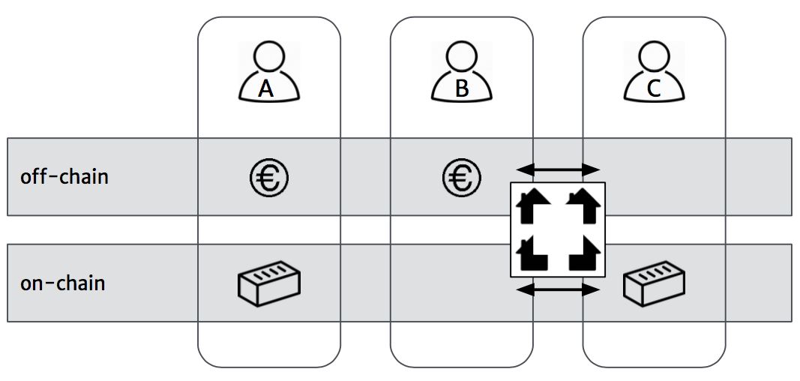
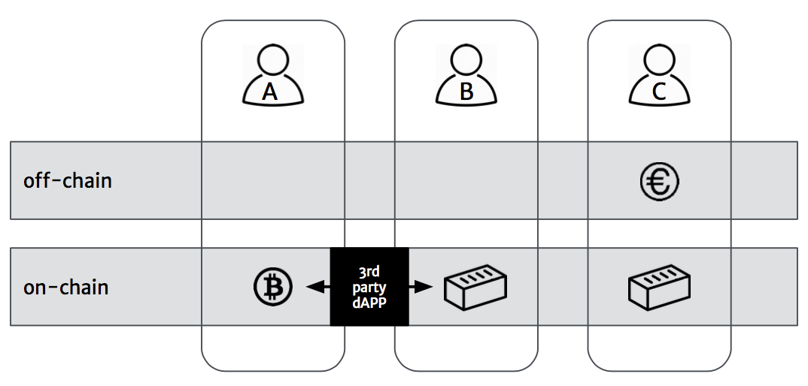
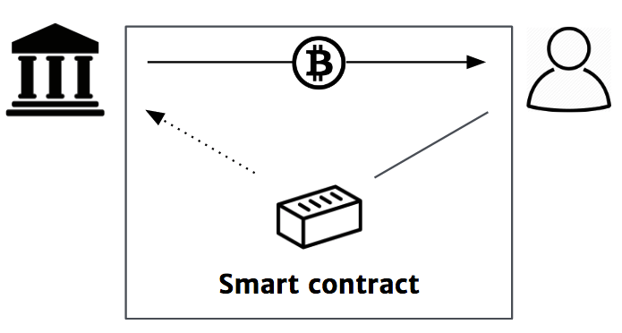

(Decentralized) APPs
====================

This section illustrates example (decentralized) services built on top of NotaryNodes.

Bloqhouse Bloq Exchange
-----------------------

.. note:: Please read the section about Bloqs first: :ref:`bloqintro`. Also note that, in contrary to the Bloq ecosystem which is open source, Bloqhouse is a commercial application.

Bloqhouse is an online wallet app that allows it users to trade Bloqs for fiat currencies (such as euros).
To support fiat currency for bloq trading, trades take place off-chain.

|

    Bloqhouse off-chain exchange

    +-----------------------------------------+-----------------------+-----------------------------------------+-----------------------+
    | .. image:: ../../images/bloq.png        | Bloq                  | .. image:: ../../images/crowd.png       | Crowd                 |
    |    :width: 20pt                         |                       |    :width: 20pt                         |                       |
    +-----------------------------------------+-----------------------+-----------------------------------------+-----------------------+
    | .. image:: ../../images/euro.png        | Fiat currency         | .. image:: ../../images/bloqhouse.png   | Bloqhouse exchange    |
    |    :width: 20pt                         |                       |    :width: 20pt                         |                       |
    +-----------------------------------------+-----------------------+-----------------------------------------+-----------------------+

Go to `Bloqhouse.com <https://www.bloqhouse.com>`__ to create an account and start trading bloqs.
Do you want to develop your own application on top of the Bloq ecosystem? Visit the :ref:`bloqstarted` pages to enroll to NotaryNodes and make your first smart contract calls.

Off- vs on-chain exchanges
--------------------------

Trading on-chain Bloqs with another on-chain asset such as the Bitcoin would allow for a complete de-central setup.

.. note:: The KYC restrictions, that are baked into the *Bloq transfer function*, still have to be met.

|

    Third party on-chain exchange

    +-----------------------------------------+-----------------------+-----------------------------------------+-----------------------+
    | .. image:: ../../images/bitcoin.png     | Bitcoin               | .. image:: ../../images/3rdparty.png    | dApp                  |
    |    :width: 20pt                         |                       |    :width: 20pt                         |                       |
    +-----------------------------------------+-----------------------+-----------------------------------------+-----------------------+

|

Collateralized peer-to-peer lending
-----------------------------------

Another application one could think of is to use Bloqs to collateralize peer-to-peer loans between friends or between a bank and customer.
Coming summer Bloqhouse plans to organize a :ref:`bloqathon` to kick-start development on top of the **open** Bloq ecoystem.

|

    Collateralized peer-to-peer lending

    +-----------------------------------------+-----------------------+
    | .. image:: ../../images/bank.png        | Bank                  |
    |    :width: 20pt                         |                       |
    +-----------------------------------------+-----------------------+
