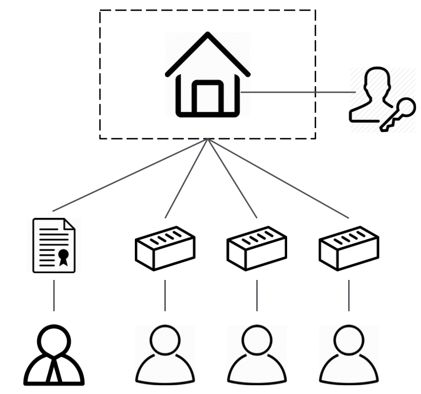
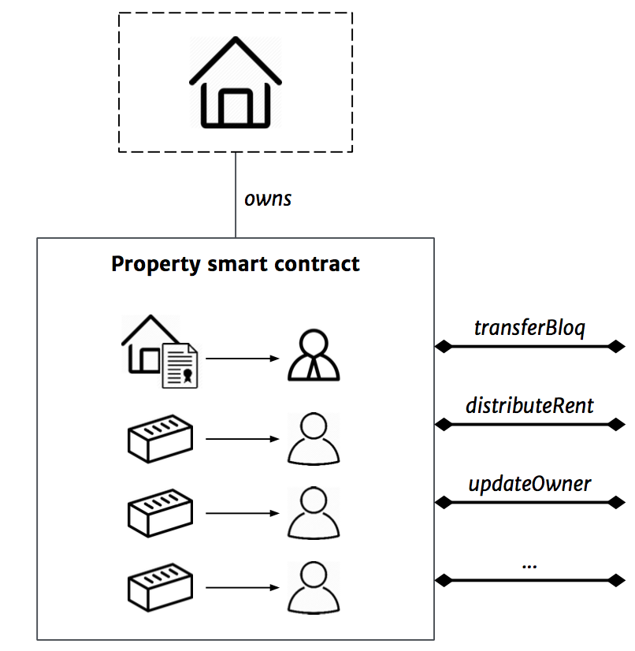
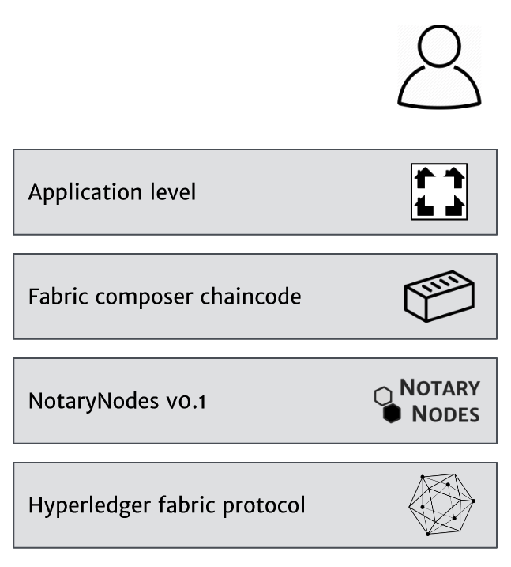

.. _bloqintro:

What is a Bloq?
===============

A Bloq is a digitized ownership certificate of an legal entity holding a real estate object.
It entitles the owner to all economic benefits realized by the legal entity. This includes the monthly rent and, if applicable, the increase in property value.
The below image explains the entities involved.

|

    Overview of entities

    +-----------------------------------------+-----------------------+-----------------------------------------+-----------------------+
    | .. image:: ../images/property.png       | Property              | .. image:: ../images/assetmanager.png   | Fund manager          |
    |    :width: 30px                         |                       |    :width: 30px                         |                       |
    +-----------------------------------------+-----------------------+-----------------------------------------+-----------------------+
    | .. image:: ../images/business.png       | Legal entity / fund   | .. image:: ../images/crowd.png          | Crowd                 |
    |    :width: 30px                         |                       |    :width: 30px                         |                       |
    +-----------------------------------------+-----------------------+-----------------------------------------+-----------------------+
    | .. image:: ../images/legalowner.png     | Legal ownership       | .. image:: ../images/tenant.png         | Tenant                |
    |    :width: 30px                         |                       |    :width: 30px                         |                       |
    +-----------------------------------------+-----------------------+-----------------------------------------+-----------------------+
    | .. image:: ../images/bloq.png           | Bloq                  |                                         |                       |
    |    :width: 30px                         |                       |                                         |                       |
    +-----------------------------------------+-----------------------+-----------------------------------------+-----------------------+

|

Characteristics of a Bloq:
  * It's a digital representation of a certificate
  * The certificate is a proof of partial economic, non-voting, ownership
  * Bloqs are fungible
  * Bloqs are tradable peer-to-peer without notary involvement
  * Bloq holders should be identifiable to prevent money laundering
  * Bloq holders are entitled to their share of the monthly rent (after costs)

|

Digitized asset
---------------

Currently it's common practice for private real estate funds to issue certificates that do not have a (standardized) digital representation.
Bloqification will replace offline (sometimes physical) shareholder registers with digital cloud-hosted smart contracts.

Per business entity a smart contract is written and deployed. Within the smart contract's inner database the names of shareholders are stored.
Regulation of financial markets requires Bloq holders to be identifiable. Bloqholder names are encrypted such that it requires two keys to decrypt them.
The fund/asset manager will hold one of them, the other is in the possession of regulators (or similar solutions).

Developers can call smart contract functions to transfer bloqs or change the fund manager (which requires a crypto signature by a notary).
See the :ref:`bloqapi` for an overview of the implemented methods.

|

    Property smart contract

|

    Architecture

|

Regulation
----------

Real estate is regulated as is trading in financial instruments. We involve **regulators** from the beginning to design solutions **collaboratively**.
Relevant regulators and institutions are Financial Markets Authority (AFM), Tax department, Dutch bank (DNB) and European central bank (ECB).

Permissioning
~~~~~~~~~~~~~

.. note:: Please read the section about :ref:`codemeetslaw` first.

Which blokchain to use, who forms the blockchain network i.e. who controls the peers?

The most disintermediating option, except for permissionless solutions, would be to have the fund managers (creators of the smart contracts) setup a peer network themselves.
The fund manager needs to be trusted by the bloqholders anyway. This option would effectively eliminate the need for any other trusted middle men such as exchanges (e.g. Euronext) and brokers.

We foresee that traditional exchanges and broker services will be replaced by more value added services that will also be more price efficient as they operate without a monopoly / authority.
An example service on top of the Bloq ecosystem is the :ref:`bloqhouse`, which provides:
* Bloqholder convenience and experience
* Fiat currency support (eliminate real world friction)
* Connection service, bringing Bloqholders together

NotaryNodes
~~~~~~~~~~~

Instead of fund managers controlling the peers. We are investigating another scenario; where a network of notaries control a network of peers.
The notary is a middle men that, by law, is already part of the chain of trust (notaries play a role in issuing the Bloqs).

We believe that instead of having many specialized permissioned blockchains (e.g. one for real estate run by fund managers and one for book vouchers run by bookstores) it makes sense
to create a scale advantage. So a general purpose permissioned blockchain where notaries guarantee integrity of protocol execution through effectively controlling the nodes.
The scale advantage should result in expertise at a lower price point. To guarantee quality at a fair price, it's important to allow competition.
That is why NotaryNodes is an open initiative that allows any registered notary to join.

The bloq smart contracts v0.1 are hosted on a pilot version of NotaryNodes, *the sweet spot between permissionless and permissioned ledgers*.

The permissionless option
~~~~~~~~~~~~~~~~~~~~~~~~~

The goal is not to use blockchain technology, which for some is equal to permissionless solutions. The goal is to create a digital real estate ownership ecoystem that accelerates innovation.
Both a permissionless and permissioned option provide many benefits to the current systems:
* it increases standardization of digital representations of assets
* the system is transparent
* there is no exchange with a trading monopoly
* smart contract logic lowers trading friction
* smart contract logic can hold mechanisms to manage identities and prevent money laundering

We believe those improvements will have a big positive impact on scaling the Bloq ecosystem and foster innovation.

See the section about :ref:`codemeetslaw` that discusses difficulties with a permissionless setup, which includes:
* updates to smart contract business logic in case of regulation changes
* forks and bugs
* protocol leadership
* risks related to an anonymous mining community
