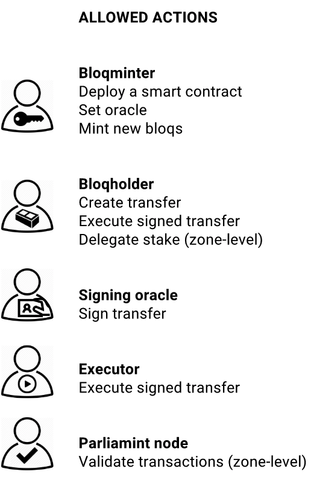
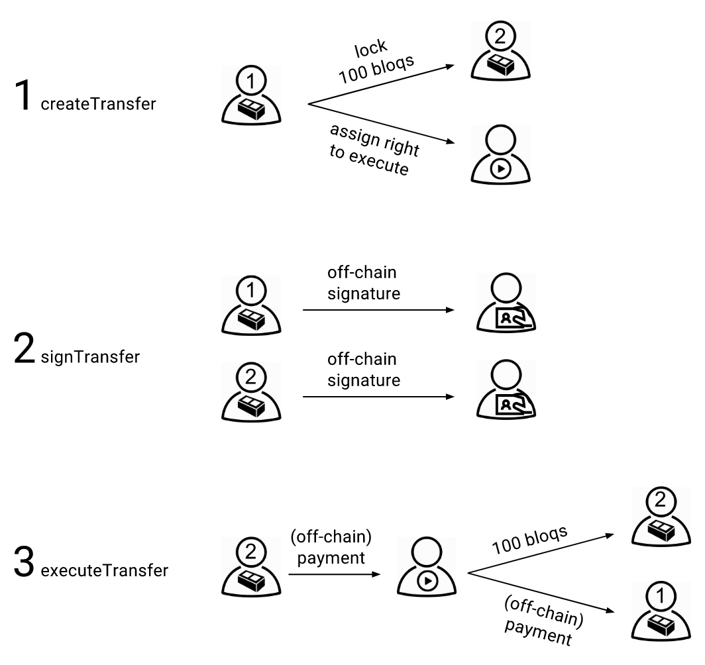
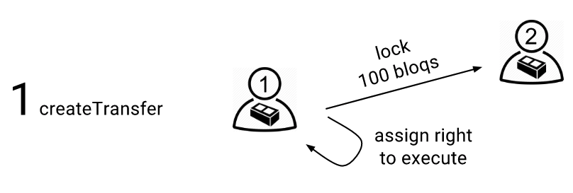

.. _bloqintro:

The BloqToken
=============

About the to be tokenized investment fund
-----------------------------------------

The first tokenized assets (Bloqs) will be real estate investment funds managed by AIFMd registered Alternative Investment Fund Managers.
A Bloq is a digitized ownership certificate of a legal entity holding a real estate object. The real estate object is rented to one or more tenants.
The Bloq entitles the owner to the economic benefits realized by the entity. The direct profit is equal to the rent minus management costs.
On the secondary market Bloqs can be traded peer-to-peer, Bloqholders can make an indirect profit from value appreciation.
Bloq value is determined by demand and supply.

Characteristics of a Bloq:
  * It's a digital representation of a (partial) economic ownership certificate
  * Bloqs entitle holders to the profits being made, it doesn't give them voting rights
  * Bloqs holders are not liable for a potential loss
  * Bloqs are fungible
  * Bloqs can be traded directly peer-to-peer without notary approval
  * Bloqholders are anonymous to the public, only the fund manager / Bloqminter knows there identity (NAW gegevens in Dutch)

|

Regulation
----------
Real estate is regulated, as is trading in financial instruments. We involve **regulators** from the beginning to design solutions **collaboratively**.
Relevant regulators and institutions are the Financial Markets Authority (AFM), Tax department, Dutch bank (DNB) and European central bank (ECB).

Smart contracts
---------------

The BloqToken smart contract implements a p2p tradable token that requires, off-chain, signatures to transfer ownership to make those transfers legally binding and to prevent money laundering.
The Bloqtoken contract maps Bloqholders to the amount of Bloqs they own. The Bloqtoken contract also defines the business rules to transfer ownership.
Bloqholders can create a transfer (step 1) that locks there balance for a certain time period (max 1 week). The created transfer only is processed after it is signed (step 2) and executed (step 3).
Execution control can be given to a (third party) account to support fiat currency, off-chain, payments or payments in other cryptocurrencies through peg zones.
Both the sending and receiving Bloqholder sign the transfer off-chain using one of the approved oracles. The oracle injects the signatures into the Bloqtoken contract.

Assigning execution control to a third party is optional, Bloqholders can also assign themselves. In that case the sending party can execute the transfer after both sender and receiver signed the transfer.

Delegating stake
----------------
Each Bloq also represents a vote in the consensus process. Bloqholders can delegate their votes to others that provide validation services in return for transaction costs.
