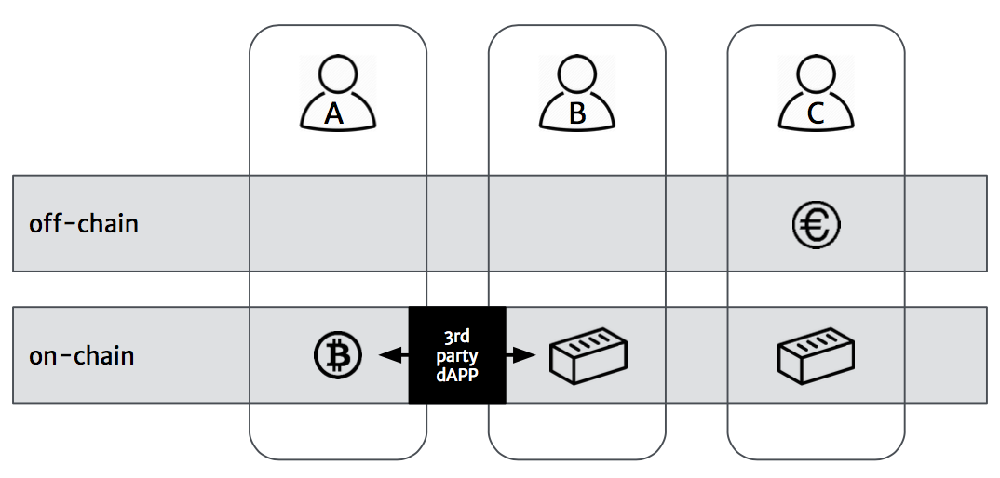

(Decentralized) APPs
====================

This section illustrates some example services built on top of the BloqToken ecosystem.

.. _bloqhouse:

Bloqhouse Bloq Exchange
-----------------------

.. note:: Please read the section about the Bloqtoken first, :ref:`bloqintro` Also note that, in contrary to the **open source** Bloq ecosystem, Bloqhouse is a commercial application.

Bloqhouse is an online wallet app (not a Dapp) that allows users to trade Bloqs with other users in exchange for fiat currencies such as EUR or USD.
To support those fiat currencies, trades take place off-chain. To facilitate transactions Bloqhouse full fils the Parliaments ecosytems roles of Executor and Signing oracle.

|

.. figure:: ../images/bloqhouse_exchange.png
    :scale: 70 %
    :alt: Bloqhouse off-chain exchange
    :align: center

Visit `Bloqhouse.com <https://www.bloqhouse.com>`__ to apply for the pilot and buy Bloqs during the Genesis Bloqs Emission (scheduled for the end of this summer).
If you want to develop your own applications on top of the Bloq ecosystem, visit the :ref:`bloqstarted` pages.

Off- vs on-chain exchanges
--------------------------

Trading on-chain Bloqs with another on-chain asset such as the bitcoins would allow for a de-central flow that does not delegate execution control to a trusted third party.
Decentral exchange / transfer of ownership could be achieved trough pegged zones and the Cosmos hub.

.. note:: The KYC signature conditions, that are baked into the *Bloq transfer function*, still have to be met.

|

|

Collateralized peer-to-peer lending
-----------------------------------

Another application one could think of is to use Bloqs to collateralize peer-to-peer loans between friends or between bank and customer.
Coming winter Bloqhouse plans to organize a :ref:`bloqathon` to kick-start development on top of the **open** Bloqtoken ecoystem.

|

.. figure:: ../images/peerlending.png
    :scale: 70 %
    :alt: Collateralized peer-to-peer lending
    :align: center
