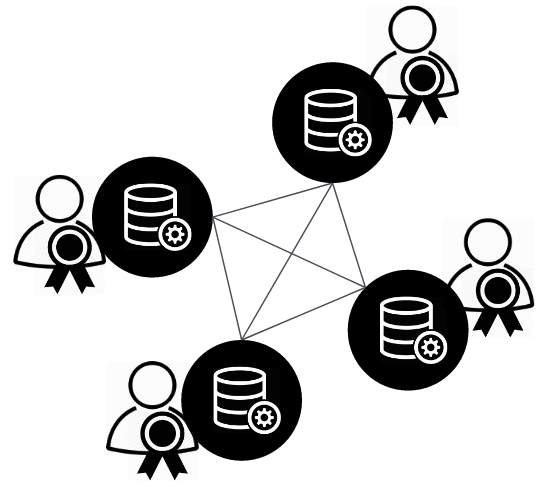

NotaryNodes V0.1
================

.. note:: The NotaryNodes initiative is technology agnostic.

The first proof-of-concept we've built on top of the Hyperledger Fabric protocol.
Assets (chaincode) were created using Fabric composer, a tool that allows developers to easily define assets and business networks in client-side javascript.

To read more about the first asset, see :ref:`bloqintro`.

* `Hyperledger fabric <https://hyperledger-fabric.readthedocs.io/en/latest>`__
* `Fabric composer <https://fabric-composer.github.io>`__

.. _fabricimplementation:

Hyperledger fabric
------------------

NotaryNodes v0.1 is a hosted instance of the fabric protocol. Integrity of protocol execution (hosting peers) is safeguarded by notaries.
Its optimized for use cases that involve regulated assets, e.g. it has out-of-the-box KYC functionality.

|

V0.1 can be considered a *general purpose* private ledger.

    NotaryNodes

    +-----------------------------------------+-----------------------+-----------------------------------------+-----------------------+
    | .. image:: ../images/notary.png         | (Dutch) notary        | .. image:: ../images/node.png           | Network node / peer   |
    |    :width: 30px                         |                       |    :width: 30px                         |                       |
    +-----------------------------------------+-----------------------+-----------------------------------------+-----------------------+

|

We are investigating the setup that allows notaries to safeguard integrity of protocol execution.
Any officially registered notary should be able to join the initiative, so that market forces create a fair transaction-cost level.

Among many other questions we are currently investigating, through workshops, what the exact role of the notary will be.

Identity management
~~~~~~~~~~~~~~~~~~~

To create digital representations of regulated assets robust baked-in *know your customer* (KYC) functionality is required.
Any serious solution will also require strong mechanisms to safeguard privacy.

|

A first solution that integrates a trusted identity provider IDIN with the Hyperledger Fabric CA was built by IBM, Van Doorne and Bloqhouse during the Dutch Blockchain Hackathon.

External sources
~~~~~~~~~~~~~~~~

* `Mr-online article idintt solution <http://www.mr-online.nl/doorne-als-enige-op-blockchain-event>`__
* `Idintt hackathon contribution, the codebase <https://github.com/notarynodes/idintt>`__
* `Dutch Blockchain Hackathon <https://blockchainhackathon.eu>`__
