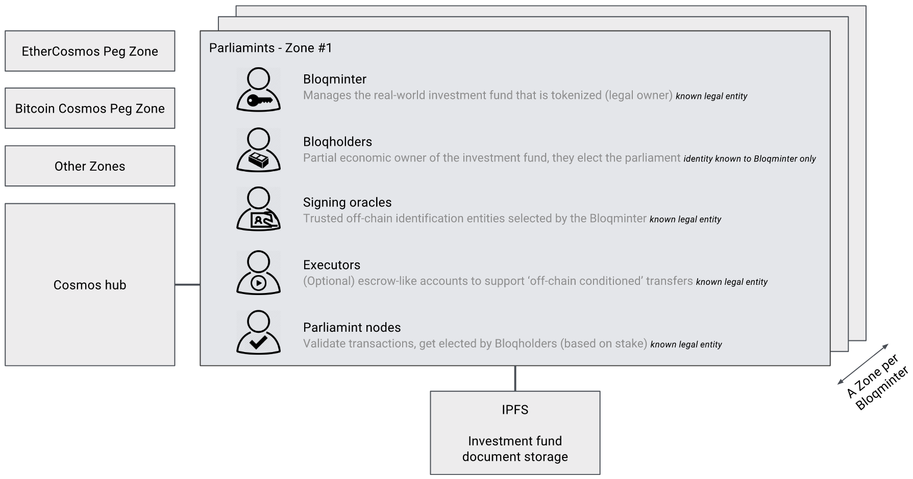
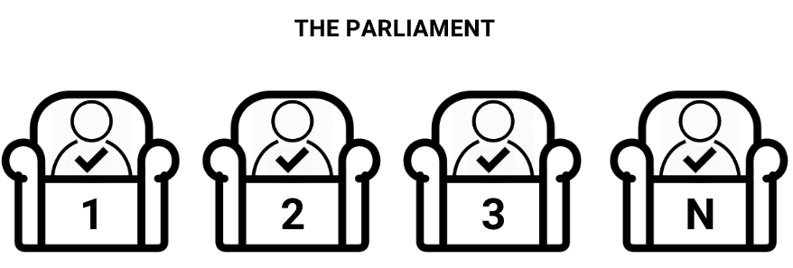

Where code meets law
====================

.. note:: Work in progress. NotaryNodes has become Parliaments.

Blockchain for real, regulated, assets
--------------------------------------
To apply blockchain technology to real assets we need to find solutions to the following (that unregulated cryptocurrencies don't need to solve):

* Dual integration (embed smart contracts in a real-world legal context)
* Fraud prevention (manage identities)
* Validator accountability
* Code-is-a-law & bug scenarios

To solve those points we introduce Parliaments; blockchain zone(s) for regulated assets under (Dutch) legal jurisdiction.

Parliaments
-----------
Parliaments are self-governed blockchains (zones) based on the Cosmos zones specification.
They rely on a proof-of-stake BFT consensus model and implement oracle technology to perform off-chain identity checks.
Smart contracts are written in Solidity and interpreted by the Ethereum virtual machine.
All validators (the parliament) identify themselves and sign a code of conduct that makes them legally accountable.

Design goals
------------
When designing the parliament technology stack and governance model the following requirements where key:

Transparency
~~~~~~~~~~~~
* Trustworthy investment funds
* Open source code
* Liquid, borderless, markets

Minimize the number of trusted parties & authorities
~~~~~~~~~~~~~~~~~~~~~~~~~~~~~~~~~~~~~~~~~~~~~~~~~~~~
* More robust ecosystem that can trusted by looking at it's codebase
* Minimal friction and costs

Non-anonymous participants that can be held accountable
~~~~~~~~~~~~~~~~~~~~~~~~~~~~~~~~~~~~~~~~~~~~~~~~~~~~~~~
* Prevent fraud
* Incentivize honest behaviour
* Create a legal safety net in case of bugs or byzantine validators (>1/3)

In contrary to most cryptocurrency designs it's **not** a design goal to make the ecosystem
completely de-centralized, as the assets traded are real world assets;
links to centralized real-world entities are thus unavoidable.

About the underlying technology
-------------------------------
We rely on the following technology stack:

* `Tendermint proof-of-stake consensus <https://tendermint.com/docs>`__
* `Solidity smart contracts <https://solidity.readthedocs.io/en/develop/>`__
* `Ethereum Virtual Machine <https://www.hyperledger.org/blog/2017/04/10/hey-you-got-your-ethereum-in-my-hyperledger>`__
* `Monax/burrow <https://github.com/hyperledger/burrow>`__
* `Ethermint <https://github.com/tendermint/ethermint>`__
* `Cosmos/IBC <https://cosmos.network/whitepaper>`__
* `IPFS <https://ipfs.io/#how>`__

The zone (blockchain where the contracts are deployed) will be IBC (inter blockchain communication) compatible.

Consensus is achieved by Tendermints, proof-of-stake, BFT algorithm.

At application level (ABCI) we rely on the Ethereum Virtual Machine (see Burrow & Ethermint).
Contracts are written in Solidity.

All investment fund documentation is stored to IPFS and linked from within the smart contracts.

Parliaments ecosystem roles
---------------------------
The blockchain zones consist of the following roles.

Bloqminter
~~~~~~~~~~
Manages the investment fund that is tokenized (is the legal owner of the fund) - known legal entity.

Bloqholders
~~~~~~~~~~~
Partial economic owners of the investment fund, they elect the parliament - identity is known to Bloqminter only.

Signing oracles
~~~~~~~~~~~~~~~
Trusted off-chain identification entities approved by the Bloqminter - known legal entity.

Executors
~~~~~~~~~
(Optional) escrow-like accounts to support (off-chain) conditional transfers - known legal entity.

Parliament nodes
~~~~~~~~~~~~~~~~
Validate transactions, they get elected by Bloqholders (based on stake) - known legal entity.

Governance rules
----------------
Governance rules are part of the code of conduct that is signed by Bloqminter, Oracles and Parliament.
Dual integration, a term coined by Monax, is captured in the code of conduct.

* Every legal person (natural person / private or public organization) can become a parliament node (validator)
* To become a parliament node, the entity has to identify himself and sign a code of conduct (that has legal status)
* Only the N highest staking parliament nodes take part in the consensus process
* Stake can be obtained by buying Bloqs and/or by getting elected by other Bloqholders
* Validators are entitled to transaction fees (that can come from other zones.. work in progress)
* Smart contracts can only be patched in case of regulation changes or bugs (arbitration/decision model is being developed)
* More rules will follow

About the stake
---------------
Bloqholders are able to elect the validators (their voting power is set by their stake). The top N validators (highest stake) participate in the consensus process.

Preferably there is no native (zone-level) currency and stake is a function of the Bloqtoken amounts possessed (at smart-contract level).
As there can be multiple Bloqtoken contracts per zone, we might need to express Bloqtokens in another currency to define stake at zone-level.

We are currently researching the different implementation scenarios.

Signature oracles
-----------------
In contrary to most cryptocurrency ecosystems Parliaments is requires participants to be known individuals/organizations.

We rely on government approved identity providers such as Idensys, NotarisID & IDIN. Those service provide legally binding qualified electronic signatures.

Trusted oracles perform off-chain signatures and inject results back into the smart contracts. The Bloqminter, who is ultimately responsible for a valid KYC processs, approves the oracles he trusts.

A first version that integrates a trusted identity provider iDIN with a blockchain solution was built by IBM, Van Doorne and Bloqhouse during the Dutch Blockchain Hackathon.
